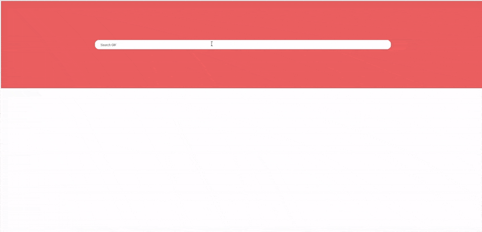

# Search GIF with redux-saga App

This is a very simple app which look a GIF with Giphy search engine.

**_DEMO:_**



## Environment

```bash
$ node -v
v13.1.0
$ yarn -v
v1.19.2
```

- React: `16.12.0`

## Dependencies

### For Application

- [redux](https://github.com/reduxjs/redux), [react-redux](https://github.com/reduxjs/react-redux)
  - Redux.
- [redux-saga](https://github.com/redux-saga/redux-saga)
  - An alternative side effect model for Redux app. This hooks Redux action in the middleware, which allows asynchronous operations.
- [axios](https://github.com/axios/axios)
  - Promise based HTTP client for the browser and node.js
- [immutable](https://github.com/immutable-js/immutable-js)
  - Immutable persistent data collections for Javascript which increase efficiency and simplicity. .
- [styled-components](https://www.styled-components.com/)
  - Visual primitives for the component age. Use the best bits of ES6 and CSS to style your apps without stress.
- [react-spring](https://github.com/react-spring/react-spring)
  - A spring physics based React animation library.

### For Development

- [Redux DevTools Extension](https://github.com/zalmoxisus/redux-devtools-extension)
  - Redux DevTools extension.
- [redux-logger](https://github.com/LogRocket/redux-logger)
  - Logger for Redux.

## How To Use

```bash
$ yarn
$ yarn start
```
